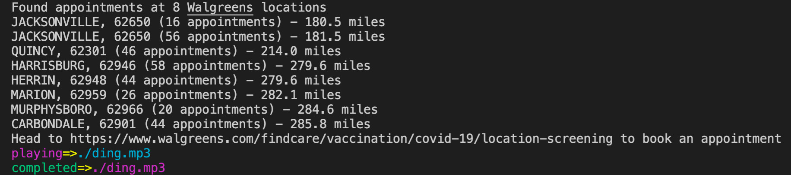

# Walgreens COVID Appointments
This simple node app makes use of the https://www.vaccinespotter.org/ API to constantly check for new COVID vaccine appointments.

## Credit
99% of the credit here goes to the brilliant https://github.com/GUI/covid-vaccine-spotter project. None of this would work without their work.

## Running
Please add your location and max travel distance to the top of `index.js`, then:

```
yarn install

node index
```

## Example results
This script returns results within your max distance threshold, sorted by the closest locations first.

